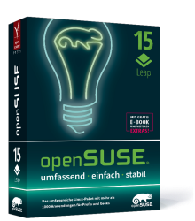

# 3. Getting openSUSE

Here are some of the ways of acquiring openSUSE.

## 3.1 Download It

You can download openSUSE free of charge. Just go to:

<a href="http://software.opensuse.org/" target="_blank">http://software.opensuse.org/</a>

The full DVD (4.7 GB) provides the most smooth and complete experience, because it is the most tested and includes all the software needed for the base install including localization for many languages. You don't have to use a DVD, it can also be put on a USB stick (see next chapter).

There's also a live DVD/USB available. It is useful for trying openSUSE live (i.e. running only from DVD/USB stick and RAM) on your hardware before installing anything. However the live DVD/USB image isn't thoroughly tested and doesn't include all base install packages and localization, thus these packages need to be installed later, which will happen automatically on the first run of YaST Software Management.

## 3.2 Buy Cheap Unofficial Media

There are many webshops that offer to sell unofficial media (DVD, USB-stick) with openSUSE very cheap. This is of course absolutely legal, as we're dealing with free software.

This saves you the trouble of downloading and burning the media yourself, and the subsequent risk of errors. See for example:

<a href="http://www.linuxpusher.com/distributions/OpenSuSE" target="_blank">Linuxpusher.com</a>

<a href="http://www.osdisc.com/cgi-bin/view.cgi/products/linux/suse" target="_blank">OSDisc.com</a>

<a href="http://www.ixsoft.de/cgi-bin/web_store.cgi?ref=Catalogs/de/opensuse-catalog.html" target="_blank">Ixsoft.de</a>

<a href="http://www.linuxiso.co.uk/product_info.php?products_id=207" target="_blank">Linuxiso.co.uk</a>

<!--

The Linuxpusher.com unofficial openSUSE DVD

-->

## 3.3 Buy a Box Set

There are companies selling openSUSE in a (German language) box with support, and additional goodies included, see:

<a href="http://en.opensuse.org/Buy_openSUSE" target="_blank">http://en.opensuse.org/Buy_openSUSE</a>

## 3.4 The Source Code

You can find the source code for all the free packages in openSUSE here, in the form of source RPM files:

<a href="http://download.opensuse.org/source/distribution/leap/42.1/repo/oss/suse/src/" target="_blank">http://download.opensuse.org/source/distribution/leap/42.1/repo/oss/suse/src/</a>
