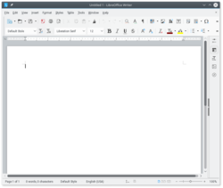
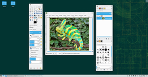
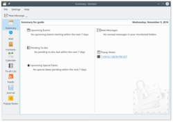

# 6. Apps for Common Tasks

Here's a list of applications used to perform common tasks, they're all installed by default and are all high quality, but naturally you can replace them with alternatives if you wish.  

<table>
<tbody>
<tr>
<td></td>
<td>All the alternatives mentioned below will be available for easy installation with the <a href="installpackage.php">package manager</a>, if the recommended <a href="repositories.php">software repositories</a> are added (see later chapters).</td>
</tr>
</tbody>
</table>

 

You can find more replacements for your familiar applications here: 
<a href="http://en.opensuse.org/Application_equivalents" target="_blank">http://en.opensuse.org/Application_equivalents</a>  

## 6.1 Surf the Web with Firefox

Mozilla Firefox is the default web browser. It's one of the world's leading web browsers.  

 

Alternatives to consider: Rekonq, Opera, Chromium, Konqueror  

## 6.2 Office Productivity with LibreOffice

LibreOffice is a complete office suite with word processing, spreadsheets, presentation, drawing and more. It's very compatible with Microsoft Office.  

 

Alternatives to consider: Calligra, Abiword, Gnumeric  

## 6.3 Listen to Music with Amarok

Amarok is a feature rich music player that handles your music, podcasts, portable music player or iPod etc. Read about codec installation in a later chapter.  

 

Alternatives to consider: Clementine, JuK, Qmmp  

## 6.4 Watch Video with Dragon Player

Dragon Player plays videos and DVDs. Read about codec installation in a later chapter.  

 

Alternatives to consider: VLC, SMPlayer, mpv, UMPlayer  

## 6.5 Image Editing with GIMP

GIMP (GNU Image Manipulation Program) is a very powerful image editing application.  

 

<table>
<tbody>
<tr>
<td></td>
<td>GIMP can work as a single window, simply click 'Windows' in the menu and check the option 'Single-Window Mode'.</td>
</tr>
</tbody>
</table>

 

Alternatives to consider: Gwenview (only very basic editing)  

## 6.6 E-mail, Calendar, News feeds and more with Kontact

Kontact is a fullblown PIM (personal information management) suite, combining e-mail, calendar, news feeds, addressbook and more in one place. Each of the Kontact components (KMail, KOrganizer, Akregator etc.) can also be used as standalone applications.  

 

Alternatives to consider: Mozilla Thunderbird  

<!--
## 6.6 Instant Messaging with Kopete

Kopete is a multi-protocol instant messenger, it supports Windows Messenger, Jabber/Google Talk, ICQ, Yahoo, Facebook and other chat protocols all within one application.  

 

Alternatives to consider: KMess, Amsn, Pidgin  
-->

<!--
## 6.8 CD and DVD Burning with K3B

K3b is a great application for various tasks related to CDs and DVDs.  

 
-->
